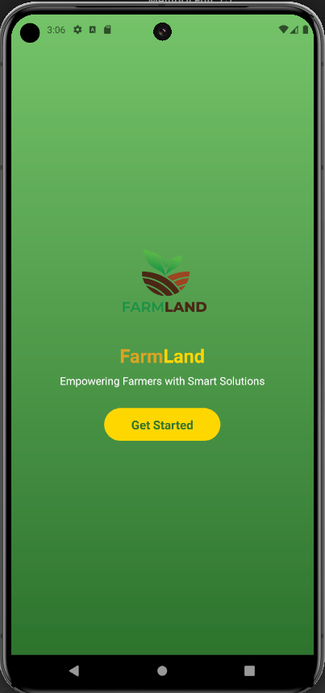
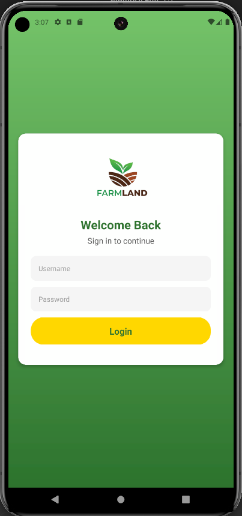
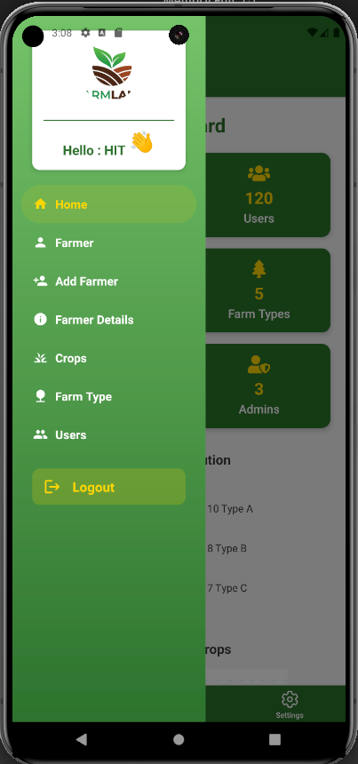

# Welcome to your Expo app 👋

This is an [Expo](https://expo.dev) project created with [`create-expo-app`](https://www.npmjs.com/package/create-expo-app).

## Application Screenshots

### Splash Screen



### Login Screen



### Dashboard Screen



## Backend Deployment

The backend for this application is **online** and has been developed using **Django**. The Django backend is deployed on **Contabo** and provides the necessary API endpoints for the mobile app to interact with. This includes user authentication, data syncing, and various other functionalities that power the app.

## Get started

1. Install dependencies:

   ```bash
   npm install

2. Running

   ```bash
   npx expo start
